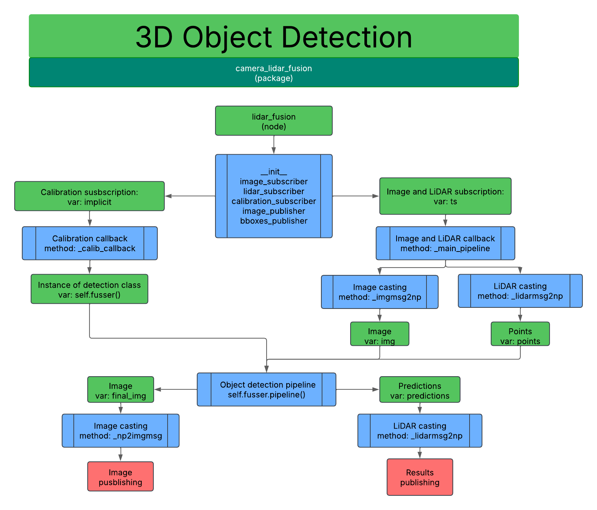

# **ROS2 Humble Camera-LiDAR Fusion**  

This repository is an adaptation of [this repository](https://github.com/Vishalkagade/Camera-Lidar-Sensor-Fusion) by **Vishalkagade**, modified to work as a **ROS 2 Humble Hawksbill** package. The main changes involve acquiring data through **ROS 2 topics** instead of specific files, enabling **real-time processing**.  

Additionally, the computational approach has been optimized to achieve real-time execution. **PyTorch** is utilized to speed up point cloud processing from the LiDAR, and all required functions have been consolidated into a single script called `fusser.py`.  

## **Package Overview**  

- **Package name:** `camera_lidar_fusion`  
- **Node name:** `lidar_fusion`  
- **Required inputs:**  
  - **Camera calibration parameters**  
  - **Image from the camera**  
  - **Point cloud from the LiDAR**  

Since topic names may vary, you will need to update them manually by editing the node script: `lidar_fusion.py`. In this file, you will also find the **output topic**, which by default publishes the fused image to:  

```
/camera_lidar_fusion/lidar_fov
```

You can modify this if needed.  

---

## **Pipeline**  

Despite the modifications, this package retains most of the original code. For additional details, please refer to the [original repository](https://github.com/Vishalkagade/Camera-Lidar-Sensor-Fusion).  

The key contribution of this adaptation is the integration with **ROS 2**. The communication flow is structured as follows:  



---

## **Installation & Usage**  

To set up and run this package, follow these steps:  

1. **Clone the repository:**  
   ```bash
   git clone https://github.com/your-repository/camera_lidar_fusion.git
   ```

2. **Move into your ROS 2 workspace:**  
   ```bash
   cd ~/ros2_ws/src
   ```

3. **Build the package:**  
   ```bash
   colcon build --packages-select camera_lidar_fusion
   ```

4. **Source the workspace:**  
   ```bash
   source ~/ros2_ws/install/setup.bash
   ```

5. **Run the node:**  
   ```bash
   ros2 run camera_lidar_fusion lidar_fusion
   ```

Ensure that the necessary camera and LiDAR topics are active before launching the node. If needed, update the topic names in `lidar_fusion.py`.  

---

## **Contributions & Issues**  

Feel free to contribute to this project or report any issues. Fork the repository and submit a **pull request** for improvements.  
